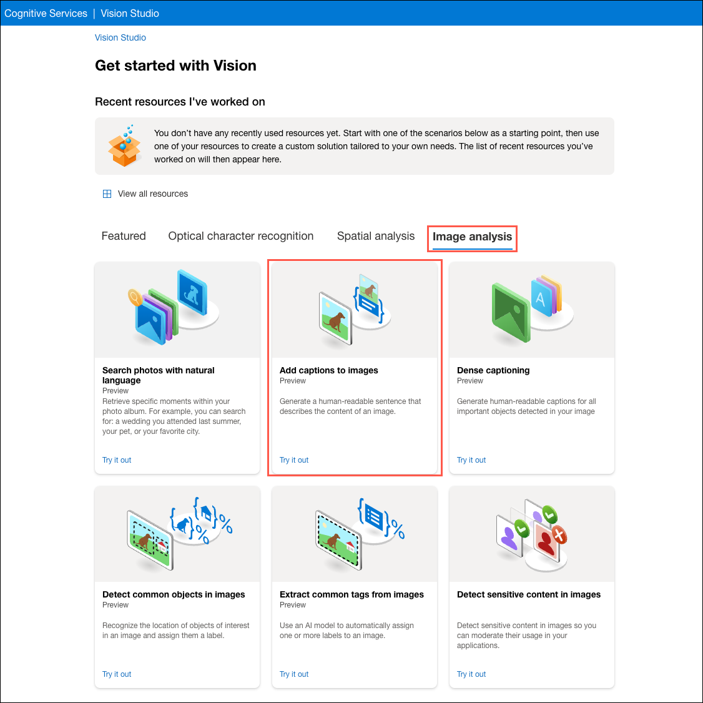
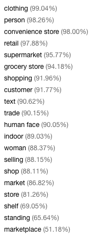
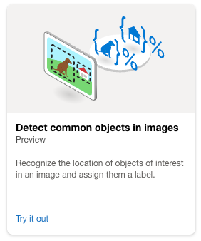

---
lab:
    title: 'Analyze images in the Vision Studio'
---

## Analyze images in the Vision Studio

**Azure AI Vision** includes numerous capabilities for understanding image content and context and extracting information from images. Azure AI Vision Studio allows you to try out many of the capabilities of image analysis. In this exercise, you will use Vision Studio to analyze images using the built-in try-it-out experiences.

Suppose the fictitious retailer *Northwind Traders* has decided to implement a "smart store", in which AI services monitor the store to identify customers requiring assistance, and direct employees to help them. By using Azure AI Vision, images taken by cameras throughout the store can be analyzed to provide meaningful descriptions of what they depict. 

> **Note**
> To complete this lab, you will need an [Azure subscription](https://azure.microsoft.com/free?azure-portal=true) in which you have administrative access.

## Create an *Azure AI services* resource

You can use the Azure AI Face service by creating either a **Computer Vision** resource or an **Azure AI services** resource.

If you haven't already done so, create an **Azure AI services** resource in your Azure subscription.

1. In another browser tab, open the Azure portal at [https://portal.azure.com](https://portal.azure.com?azure-portal=true), signing in with your Microsoft account.

1. Search for and select **Resource Group** in the Marketplace, then select **Create**. Configure the resource group with the following settings:
    - **Subscription**: *Your Azure subscription*
    - **Resource Group**: rg-ms-learn-vision
    - **Region**: (US) East US

    Select **Review + Create**, then select **Create**. 

3. Return to the Azure portal Marketplace. Search for and select **Azure AI services**, then select **Create**. 

    Configure the resource with the following settings:
    - **Subscription**: *Your Azure subscription*
    - **Resource Group**: rg-ms-learn-vision
    - **Region**: East US
    - **Name**: cog-ms-learn-vision-SUFFIX 
        - *note: replace the SUFFIX token with your initials or another value to ensure the resource name is globally unique.*
    - **Pricing tier**: S0
    - *Acknowledge that you have read and understood the terms by checking the box.*

    Select **Review + Create**, then select **Create**. 

    **Note**: Image Analysis 4.0 features are currently available in a limited number of Azure regions. Specifying `East US` ensures access to the 4.0 features from Vision Studio.

    Once the resource is deployed, select **Go to Resource**.

## Connect your Azure AI service resource to Vision Studio

Next, connect the Azure AI service resource you provisioned above to Vision Studio so it can be used for trying out image analysis.

1. In a web browser, navigate to [Vision Studio](https://portal.vision.cognitive.azure.com?azure-portal=true).

2. Sign in with your account and making sure you are using the same directory as the one where you have created the `cog-ms-learn-vision-SUFFIX` Azure AI service resource.

3. On the Vision Studio home page, select **View all resources** under the **Getting started with Vision** heading.

    

4. On the **Select a resource to work with** page, hover your mouse cursor over the `cog-ms-learn-vision-SUFFIX` resource you created above in the list and then check the box to the left of the resource name, then select **Select as default resource**.

    

## Generate captions for an image

You are ready to use [Vision Studio](https://portal.vision.cognitive.azure.com/) to look at the image captioning functionality of Azure AI Vision. Image captions are available through the **Caption** and **Dense Captions** features.

1. In a web browser, navigate to [Vision Studio](https://portal.vision.cognitive.azure.com/).

2. On the **Getting started with Vision** landing page, select the **Image analysis** tab and then select the **Add captions to images** tile.

    

3. Under the **Try It Out** subheading, acknowledge the resource usage policy by reading and checking the box.  

4. Unzip the folder containing the images and locate the file named `city-street.jpg`.

    

5. Drag the `city-street.jpg` image into the **Drag and drop files here** box, or browse to the location you downloaded the file and select it.

    

6. Observe the generated caption text, visible in the **Detected attributes** panel to the right of the image.

    The **Caption** functionality provides a single, human-readable English sentence describing the image's content.

8. Next, use the same image to perform **Dense captioning**. Return to the **Vision Studio** home page, and as you did before, select the **Image analysis** tab, then select the **Dense captioning** tile.

    

    The **Dense Captions** feature differs from the **Caption** capability in that it provides multiple human-readable captions for an image, one describing the image's content and others, each covering the essential objects detected in the picture. Each detected object includes a bounding box, which defines the pixel coordinates within the image associated with the object.

10. Hover over one of the captions in the **Detected** attributes list and observe what happens within the image.

    

    Move your mouse cursor over the other captions in the list, and notice how the bounding box shifts in the image to highlight the portion of the image used to generate the caption.

## Tagging images

The next feature you will try is the **Extract Tags** functionality of Image Analysis 4.0. Extract tags is based on thousands of recognizable objects, including living beings, scenery, and actions.

1. Return to the home page of Vision Studio, then select the **Extract common tags from images** tile under the **Image analysis** tab.

    

2. In the **Choose the model you want to try out**, leave **Pretrained Vision model** selected. In the **Choose your language**, select **English** or a language of your preference.

3. Open the folder containing the images you downloaded and unzipped and locate the file named `shopping.jpg` within the `try-it-out` folder.

4. Drag the `shopping.jpg` file into the **Drag and drop a file here** box, or select **Browse for a file** and retrieve the `shopping.jpg` file from the location you saved it to your local computer.

    

5. Review the list of tags extracted from the image and the confidence score for each in the detected attributes panel.

    | Image | Tags  |
    | :---: | :---: |
    |  | 

    Notice in the list of tags that it includes not only objects, but actions, such as `shopping`, `selling`, and `standing`.

## Object detection

In this task, you use the **Object detection** feature of Image Analysis. Object detection detects and extracts bounding boxes based on thousands of recognizable objects and living beings.

1. Return to the home page of Vision Studio, then select the **Detect common objects in images** tile under the **Image analysis** tab.

    

2. In the **Choose the model you want to try out**, leave **Pretrained Vision model** selected.

3. Open the folder containing the images you downloaded and unzipped and locate the file named `road-scene.jpg` within the `try-it-out` folder.

4. Drag the `road-scene.jpg` file into the **Drag and drop a file here** box, or select **Browse for a file** and retrieve the `road-scene.jpg` file from the location you saved it to your local computer.

    

5. In the **Detected attributes** box, observe the list of detected objects and their confidence scores.

6. Hover your mouse cursor over the objects in the **Detected attributes** list to highlight the object's bounding box in the image.

7. Move the **Threshold value** slider until a value of 70 is displayed to the right of the slider. Observe what happens to the objects in the list.

    The threshold slider specifies that only objects identified with a confidence score or probability greater than the threshold should be displayed.


## Learn more

To learn more about what you can do with this service, see the [Computer Vision page](https://azure.microsoft.com/products/ai-services?activetab=pivot:visiontab).


# Explore Computer Vision

Use your Computer Vision service to analyze the following image, taken by a camera in the Northwind Traders store:


1. Review the results of the image analysis, which include:
    - A suggested caption that describes the image.
    - A list of objects identified in the image.
    - A list of "tags" that are relevant to the image.

1. Now let's try another image:

    

    To analyze the second image, enter the following command:

    ```PowerShell
    ./analyze-image.ps1 store-camera-2.jpg
    ```

1. Review the results of the image analysis for the second image.

1. Let's try one more:

    

    To analyze the third image, enter the following command:

    ```PowerShell
    ./analyze-image.ps1 store-camera-3.jpg
    ```

1. Review the results of the image analysis for the third image.

## Learn more

This simple app shows only some of the capabilities of the Computer Vision service. To learn more about what you can do with this service, see the [Computer Vision page](https://azure.microsoft.com/products/ai-services?activetab=pivot:visiontab).

